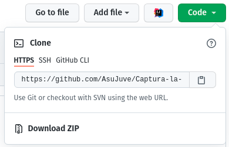
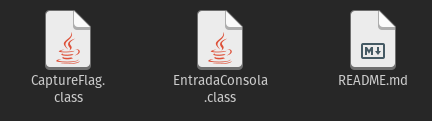
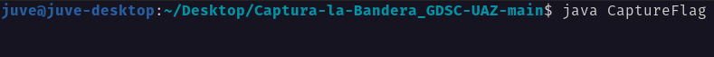

# ⛳ Captura la Bandera GDSC UAZ

Si haz llegado hasta aquí significa que te encuentras cerca de **capturar la bandera,** que haz conocido mejor el servidor de Discord de la comunidad, y claro, podrás resaltar entre los demás que asistieron a la transmisión de hoy al obtener la bandera 😎. 

En este repositorio se encuentra un programa de consola en Java, el cual deberás ejecutar para ingresar las pistas que hayas recolectado. Cuando hayas dado todas las pistas, el programa te dará un link al cual deberás ingresar para obtener la bandera y mostrarla en la transimisión en vivo

No olvides que para poder obtener la bandera, deberás haber completado y obtenido las demás pistas obtenidas en el canal de Discord. Si aún no las obtienes todas, debes volver al servidor y apurarte a encontrarlas.

---

# 📑 Instrucciones

Para poder descargar o clonar este repositorio, posicionarte en la carpeta donde se descargaron los archivos y correr el siguiente comando en consola para ejecutar el programa:

```bash
java CaptureFlag
```

A partir de ahí el programa te dará las indicacione para poder ingresar las pistas y obtener la bandera, apurate a ingresarlas!

Si no conoces la manera para descargar un repositorio de GitHub o ejecutar un programa con Java, a continuación te dejamos una breve explicación

## ⬇️ Descargar repositorio y ejecutar programa

1. Como primer paso, daremos click en el botón verde que dice "Code". encontrandonos en la página principal del repositorio.

    

2. Ahora que se nos muestran las opciones para descargar el repositorio, daremos click en el botón que dice "Download ZIP". Esto para descargar un archivo comprimido con el programa que ejecutarás.

    

3. Ahora que se descargó el archivo ZIP, lo extraeremos para obtener los siguientes archivos: 

    

    Recuerda no modificar de ninguna manera los archivos, de manera contraria el programa no se ejecutará de maner correcta.

4. Desde la consola de comandos, nos ubicaremos en la carpeta donde se extrajeron los archivos, y ejecutaremos el siguiente comando:

    

    Copia el comando para evitar cualquier error de tipografía:

    ```bash
    java CaptureFlag
    ```

5. A partir de aquí, ahora que haz ejecutado el programa, se te mostrarán las instrucciones correspondientes para ingresar las pistas dentro de la consola. Esperamos que los pasos anteriores te sirvan para poder capturar la dichosa bandera, y recuerda avisar en la transimión cuando lo logres.
